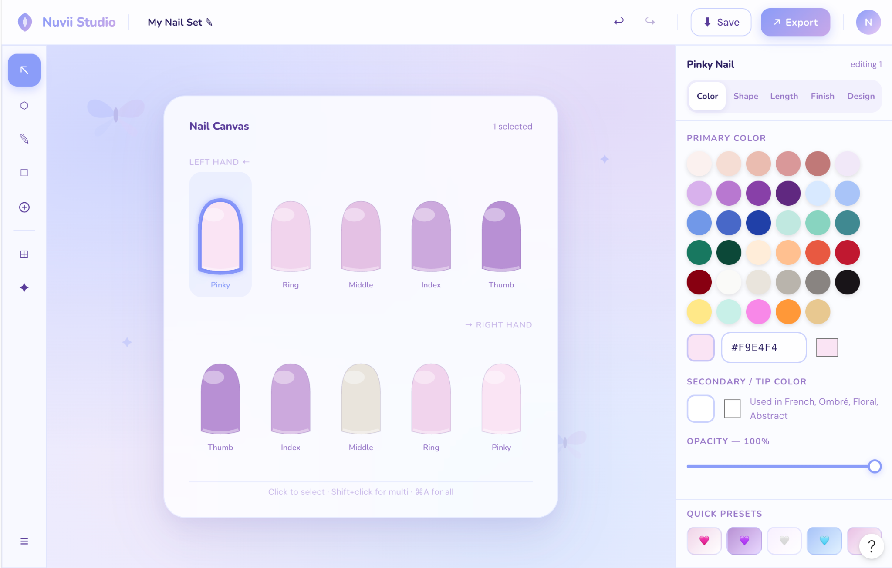
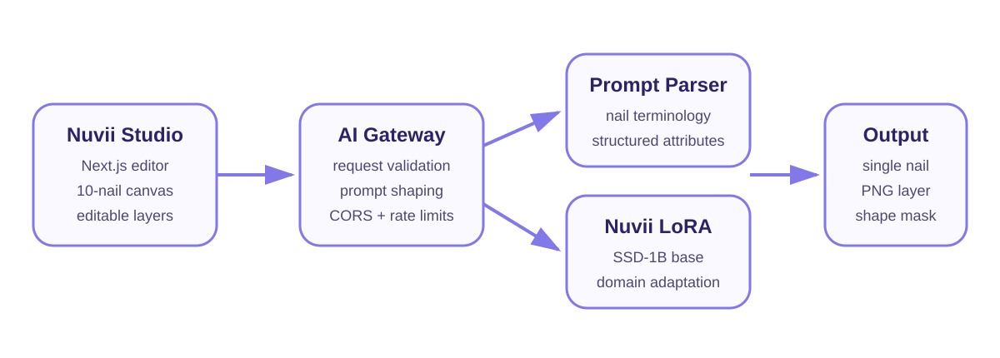

# Nuvii Studio

**A browser-based press-on nail design workspace with an editable 10-nail canvas, organized art assets, and a nail-specialized generative AI pipeline.**



## Why I built it

Custom press-on design work often requires switching between reference photos, drawing tools and repeated mockups across several nail shapes. Nuvii Studio brings the process into one interface: artists can design all ten nails, reuse organized assets, and generate new nail-specific concepts from natural-language descriptions.

## Product highlights

- Ten-nail canvas with almond, oval, square, coffin and stiletto shapes
- Per-nail colour, length, finish and design controls
- Editable 2D, 3D, charm and isolated-chrome layers
- Drag, resize, rotate, duplicate, reorder and keyboard-delete interactions
- Local project saving and image export
- Nail terminology parser for French, aura, ombré, isolated chrome, 3D gel and more
- User-owned dataset of 200 cropped press-on nails with train/validation/test splits
- Low-memory Kaggle LoRA training notebook for a nail-specialized SSD-1B model

## Architecture



## Repository layout

```text
apps/studio/             Next.js nail design editor
apps/ai-worker/          Cloudflare Worker prototype gateway
ml/notebooks/            Kaggle LoRA training notebook
ml/prompting/            Nail terminology parser
ml/inference/            Single-nail generation script
ml/scripts/              Dataset validation utilities
ml/schemas/              Controlled label vocabulary and JSON schema
ml/data/                 Public metadata and a synthetic sample only
docs/                    Architecture, dataset and roadmap notes
tests/                   Prompt parser tests
```

## Run the editor locally

Requirements: Node.js 20+

```bash
cd apps/studio
cp .env.example .env.local
npm install
npm run dev
```

Open `http://localhost:3000`.

The editor can run without the AI endpoint for manual design work. To enable the prototype generator, set `NEXT_PUBLIC_NUVII_AI_URL` in `.env.local`.

## Run the AI gateway

```bash
cd apps/ai-worker
npm install
npm run dev
```

The Worker is a prototype gateway. The custom LoRA model will ultimately run on a GPU inference service, with the Worker handling validation, routing and browser-safe access.

## Train the nail-domain model

The private training images and trained weights are intentionally excluded from GitHub.

1. Attach `nuvii_training_dataset_v1_full.zip` to a Kaggle notebook.
2. Enable a T4 GPU and Internet access.
3. Import `ml/notebooks/Nuvii_Kaggle_Low_Memory_SSD1B_LoRA.ipynb`.
4. Run the cells from top to bottom.
5. Download `nuvii_ssd1b_lora_outputs.zip` after training and evaluation.

The notebook includes the corrected Accelerate logger setting: `--report_to=tensorboard`.

## Generate a nail after training

```bash
pip install -r requirements-inference.txt
python -m ml.inference.generate_single_nail \
  --lora /path/to/nuvii_ssd1b_lora \
  --prompt "long almond milky nude nail with silver isolated chrome bow near the cuticle" \
  --output generated_nail.png
```

## Validate a dataset folder

```bash
pip install Pillow
python ml/scripts/validate_dataset.py ml/data/sample
```

## Dataset policy

The training photos are original Nuvii work and are not distributed in this repository. Public files include only the controlled vocabulary, set-level metadata and a synthetic sample. See [DATASET_CARD.md](DATASET_CARD.md).

## Current status

- Editor MVP: functional
- Asset system: functional
- Text-to-image prototype: functional
- Nail-domain dataset: prepared
- LoRA training: in progress
- Production inference integration: planned

## Resume description

> Built Nuvii Studio, a Next.js press-on nail design platform with a ten-nail editor, reusable 2D/3D asset layers and a domain-specific generative AI pipeline. Created and labeled a 200-image owned dataset, implemented nail-terminology parsing, and developed a low-memory LoRA training workflow for specialized single-nail generation.

## Rights and licensing

Source code is licensed under MIT. The Nuvii name, logo, proprietary nail photographs, dataset and trained model weights are excluded from that license. See [NOTICE.md](NOTICE.md).
